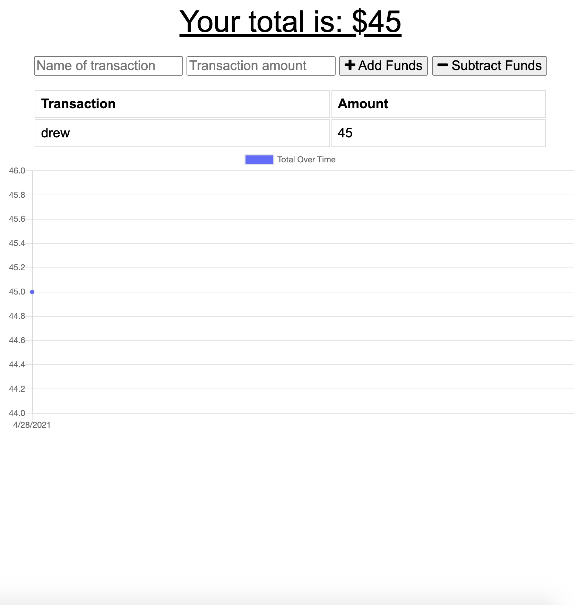

# symmetrical-giggle
 
  (https://opensource.org/licenses/MIT)

 ##  Description
 ### This project uses mongodb, mongoose, express, service workers and a manifest to create an application to track your budget! The application has been deployed to heroku in connection with Mongo Atlas
 
 Link to deployed application : https://budget-tracker-man.herokuapp.com/

 ---
 ## Table of Contents
 - [Installation](#installation)
 -[License](#license)
 -[Tests](#tests)
 -[Questions](#questions)
 ---
 ## Installation
 ###### npm i

 
 ## License
 ###### This project is licensed under the terms of MIT
 ###### license.
 
 
 ## Tests
 ###### Run npm test to run tests.
 
 ## Questions
 ###### If you have any questions about this repo, contact https://github.com/drewvena/symmetrical-giggle
 
 ## Email
 ###### drewvena1@gmail.com